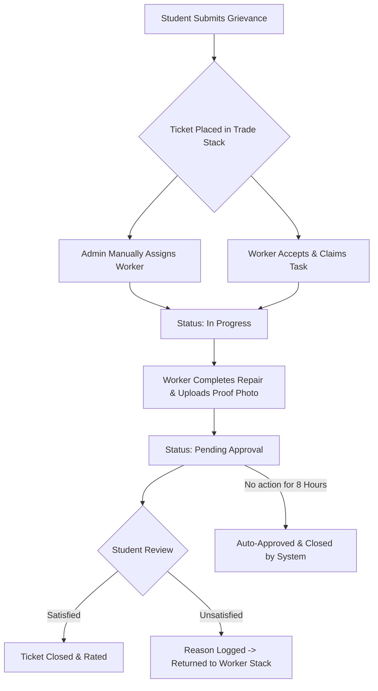

# 🏫 Campus Care — Smart Campus Grievance Redressal & Maintenance System

**Campus Care** is an enterprise-grade, role-based web application designed to streamline campus facility management, issue reporting, maintenance workflows, and service quality assurance. Built with a high-performance modern tech stack, Campus Care features real-time Socket.io updates, strict Role-Based Access Control (RBAC), automated SLA countdown timers, worker trade-stack filtering, photo proof verification, and an automated 8-hour resolution approval engine.

---

## 🚀 Key Features & Architectural Highlights

### 👨‍🎓 1. Student Portal
* **Issue Submission**: Report campus infrastructure, electrical, plumbing, carpentry, IT/network, or HVAC issues with category tags, location details, and photo damage attachments.
* **Real-time SLA Tracking**: Live countdown timers (`SLATimer`) for each reported grievance based on category-specific Service Level Agreements (SLAs).
* **Two-Step Resolution Verification**:
  * When a technician completes a repair, the ticket enters `Pending Approval` status.
  * Students can inspect the technician's uploaded **Completion Proof Photo**.
  * **Satisfied**: Closes the ticket permanently and unlocks the 5-star service rating prompt.
  * **Unsatisfied**: Requires a mandatory reason from the student and automatically returns the ticket to the maintenance stack for re-work.
* **8-Hour Auto-Closure Safety**: If no action is taken by the student within 8 hours of approval request, the system automatically marks the ticket as satisfied and closed.

### 👨‍🔧 2. Maintenance Worker / Technician Portal
* **Department & Trade Filtering**: Strict trade isolation ensuring technicians only see tickets relevant to their specialization (e.g. Electrical staff cannot view plumbing issues).
* **Unassigned Stack Claiming**: Tickets are not forcibly auto-assigned; workers can browse their trade stack and click **Accept & Claim Task** to assign tickets to themselves.
* **Job Progress & Proof Upload**:
  * Mark tasks as `In Progress`.
  * Upload **Completion/Repair Proof Photos** via integrated multipart storage before requesting student review.
* **Completed Orders History**: Comprehensive log of resolved and closed work orders with student rating feedback.

### 🛡️ 3. Admin Control Center
* **Executive Analytics Dashboard**: Real-time visual metrics powered by Recharts:
  * Overall Complaint Distribution (Open, Assigned, In Progress, Resolved, Escalated, SLA Breaches).
  * Interactive Pie Charts for Category Breakdown.
  * Bar Charts for Priority Level Distribution.
* **Complaint Management Panel**: Filter complaints by status, category, priority, or text search.
* **Manual Technician Allocation**: Override or assign unallocated tickets to specific registered technicians.
* **Admin-Exclusive Escalation**: Strictly scoped capability permitting only Administrators to override ticket priority levels to `Critical` / `Escalated`.

### ⚡ 4. Real-time Socket.io Integration
* Full bi-directional WebSocket communication (`useSocket` hook on frontend, Socket.io on Node backend).
* Real-time push notifications across active sessions when tickets are created, assigned, updated, or approved—eliminating the need for manual page refreshes.

---

## 🛠️ Technology Stack

### **Frontend**
| Technology | Role / Purpose |
| :--- | :--- |
| **Next.js 14** | React Framework with App Router & SSR capabilities |
| **TypeScript** | Type safety and strict interface contracts |
| **Vanilla CSS / Glassmorphism** | Custom design system with modern glass panels & curated HSL color palettes |
| **Recharts** | Interactive administrative analytics & graphical visualizers |
| **Lucide React** | Scalable vector icons & role-specific figurine avatars |
| **Sonner** | Modern toast notification stack |
| **Socket.io-client** | Real-time event listener for live updates |

### **Backend**
| Technology | Role / Purpose |
| :--- | :--- |
| **Node.js & Express** | REST API Server architecture |
| **TypeScript** | Type-safe backend handlers & controller logic |
| **SQLite & Prisma ORM** | Relational database storage with schema migrations |
| **JWT (JSON Web Tokens)** | Secure stateless authentication & RBAC middleware |
| **Google Auth Library** | Google Identity Services OAuth2 token verification |
| **Multer** | Multipart form-data handling for photo uploads |
| **Socket.io** | WebSocket engine broadcasting live system state changes |

---

## 📁 Repository Directory Structure

```
shadow_stack-sarvesh-main/
├── backend/
│   ├── prisma/
│   │   ├── dev.db             # SQLite database file
│   │   └── schema.prisma      # Database schema definition (User, Complaint, AuditLog, Rating, Category)
│   ├── uploads/               # Static directory for uploaded attachments & proof images
│   ├── src/
│   │   ├── lib/               # Prisma client instance & helper utilities
│   │   ├── middleware/        # JWT Authentication & RBAC protection middleware
│   │   ├── routes/            # Express route handlers
│   │   │   ├── analytics.ts   # System stats & worker performance calculations
│   │   │   ├── auth.ts        # Register, Login, Google OAuth2, GetMe
│   │   │   ├── categories.ts # Grievance category lookup
│   │   │   ├── complaints.ts # Core ticket lifecycle CRUD, assignment, status, approval
│   │   │   ├── upload.ts     # File storage endpoint
│   │   │   └── users.ts      # User management endpoints
│   │   ├── services/
│   │   │   └── autoApproveService.ts # Background cron job for 8-hour auto-approval
│   │   └── server.ts          # Express HTTP server & Socket.io initialization
│   ├── package.json
│   └── tsconfig.json
│
└── frontend/
    ├── public/                # Static public assets
    ├── src/
    │   ├── app/               # Next.js App Router pages
    │   │   ├── layout.tsx     # Global HTML shell, fonts, & AuthProvider wrapper
    │   │   ├── page.tsx       # Combined Gateway Portal (Sign-in) & Student Dashboard
    │   │   ├── login/         # Dedicated login route
    │   │   ├── admin/         # Admin Control Center & Analytics
    │   │   ├── worker/        # Worker Trade Stack & Task Manager
    │   │   └── complaints/    # Complaint lists, creation, & ticket detail view (`[id]`)
    │   ├── components/        # Reusable UI component library
    │   │   ├── layout/        # Modern Glassmorphic Navbar & Sidebar with vector figurines
    │   │   ├── complaints/    # SLATimer, ComplaintCard, StatusBadge, RatingModal
    │   ├── context/
    │   │   └── AuthContext.tsx # Authentication state manager (JWT & Google Auth)
    │   ├── lib/
    │   │   ├── api.ts         # Centralized Fetch API wrapper & backend HTTP methods
    │   │   ├── socket.ts      # Socket.io client initialization & React hook
    │   │   └── utils.ts       # Formatting & helper utilities
    │   └── types/             # TypeScript interfaces for User, Complaint, AuditLog, Rating
    ├── package.json
    └── tsconfig.json
```

---

## 🗄️ Database Schema Summary (Prisma ORM)

* **`User`**: System accounts (`student`, `worker`, `admin`) with authentication credentials, roll numbers, department/trade specializations, and Google IDs.
* **`Complaint`**: Central grievance record tracking priority (`low`, `medium`, `high`, `critical`), status (`open`, `assigned`, `in_progress`, `pending_approval`, `resolved`, `closed`, `escalated`), location, original damage photos, assigned technician, SLA deadlines, and approval request timestamps.
* **`AuditLog`**: Complete historical audit trail logging every status change, priority escalation, time stamp, operator ID, and optional worker proof/comment strings (`[PROOF_IMAGE: url]`).
* **`Rating`**: Post-resolution student satisfaction ratings (1 to 5 stars) with text feedback.
* **`Category`**: Pre-configured categories (Electrical, Plumbing, Carpenter, IT/Network, AC/HVAC, General) mapped to standard SLA resolution deadlines in hours.

---

## 🚦 System Workflow & Lifecycle



---

## ⚙️ Environment Setup & Local Installation

### Prerequisites
* **Node.js**: v18.x or higher
* **npm**: v9.x or higher

### 1. Backend Setup
```bash
# Navigate to backend directory
cd backend

# Install dependencies
npm install

# Initialize SQLite database and run Prisma migrations
npx prisma db push

# (Optional) Seed initial categories or admin accounts if required
npx prisma db seed

# Start backend server (runs on http://localhost:5000)
npm run dev
```

### 2. Frontend Setup
```bash
# Navigate to frontend directory
cd frontend

# Install dependencies
npm install

# Start Next.js development server (runs on http://localhost:3000)
npm run dev
```

---

## 🛡️ Role Access Matrix

| Feature | Student | Worker | Admin |
| :--- | :---: | :---: | :---: |
| Submit New Grievance | ✅ | ❌ | ❌ |
| View Trade-Specific Stack | ❌ | ✅ | ✅ |
| Accept / Claim Unassigned Task | ❌ | ✅ | ❌ |
| Upload Repair Completion Photo | ❌ | ✅ | ❌ |
| Approve / Reject Repair Work | ✅ | ❌ | ❌ |
| Submit Resolution Rating | ✅ | ❌ | ❌ |
| Manual Technician Allocation | ❌ | ❌ | ✅ |
| Priority Escalation to Critical | ❌ | ❌ | ✅ |
| System Performance Analytics | ❌ | ❌ | ✅ |

---

## 📝 License & Maintenance

This project is built and maintained for smart campus administration. Designed with a modular architecture for easy scalability, extension to multi-tenant educational institutions, and integration with third-party IoT maintenance systems.
```